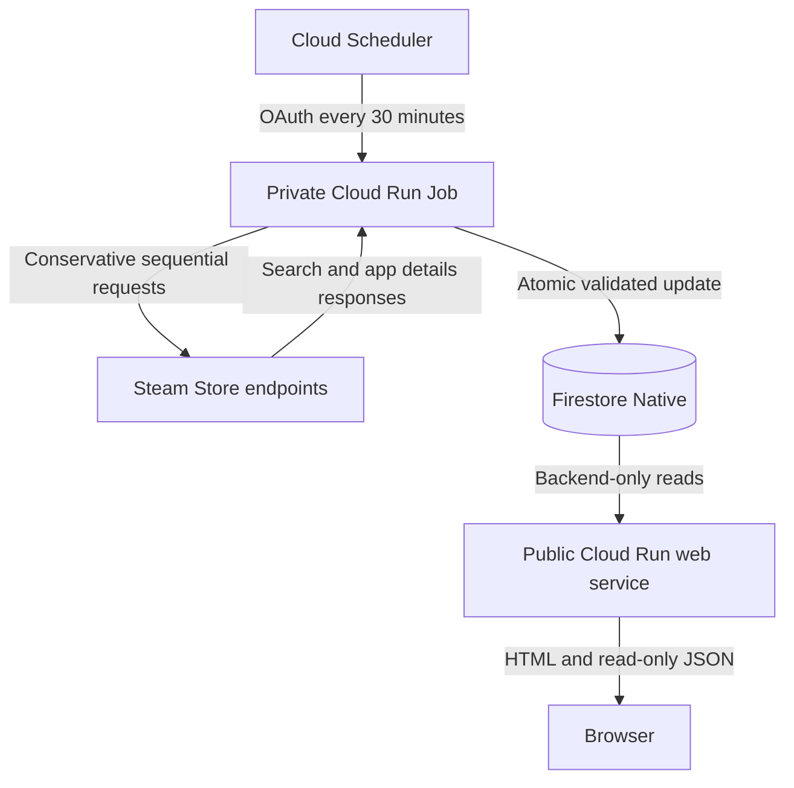

# Architecture

## Overview

FreeOnSteam separates public reads from private synchronization. The website never calls Steam during a user request and never exposes a write or sync endpoint. Steam availability therefore does not control page latency, and a failed upstream check cannot erase the last successful dataset.

## Components

### Cloud Run web service

The Next.js App Router application renders the homepage and serves `/api/games` and `/api/health`. It uses Application Default Credentials through its dedicated service account with `roles/datastore.viewer`. It has no Firestore write permission and no synchronization route.

### Cloud Run synchronization job

The job runs `node dist/sync.cjs` from the same immutable container image as the web service. It owns the Steam adapter, validation pipeline, structured logs, and Firestore write transaction. Its service account has `roles/datastore.user` and no public invoker binding.

### Cloud Scheduler

Scheduler sends an authenticated OAuth `POST` to the Cloud Run Jobs v2 `:run` endpoint every 30 minutes. Its dedicated service account receives `roles/run.invoker` on only the synchronization job.

### Steam adapter

`src/lib/steam/client.ts` isolates the unofficial storefront integration. It uses:

- Store search discovery with `specials=1`, `maxprice=free`, `category1=998`, `cc=BR`, and `l=english`.
- Sequential app-details validation for each deduplicated App ID.
- A descriptive User-Agent, request timeout, limited retries, exponential backoff, and configurable delay.
- Zod response validation and a hard pagination safety limit.

The adapter deliberately fails a synchronization when a result page is malformed or its required structure disappears. It never fabricates candidates.

## Validation boundary

`src/lib/promotion-filter.ts` accepts a title only when every required condition is established:

- `type` is exactly `game`.
- `is_free` is explicitly `false`.
- Original price is greater than zero.
- Current price is zero.
- Discount percentage is exactly 100.
- Currency is present and valid.
- Text and genre metadata do not indicate Free-to-Play or temporary access.

Demos, DLC, music, software, and videos fail the type check. Free weekends and trials fail conservative text checks. Missing or malformed pricing is rejected as ambiguous.

## Firestore data model

### `games/{appid}`

| Field | Type | Notes |
| --- | --- | --- |
| `appid` | number | Steam App ID and document identity. |
| `name` | string | Sanitized English storefront name. |
| `slug` | string | Stable display slug. |
| `type` | `game` | Validated base-game type. |
| `headerImage` | string or null | Allowlisted HTTPS Steam image URL. |
| `originalPriceCents` | number | Original Brazilian-region price in minor units. |
| `currentPriceCents` | `0` | Required current price. |
| `currency` | string | Three-letter currency code, normally `BRL`. |
| `discountPercent` | `100` | Required discount percentage. |
| `storeUrl` | string | Generated HTTPS Steam browser URL. |
| `steamClientUrl` | string | Generated `steam://store/{appid}` URL. |
| `promotionDetectedAt` | timestamp | First detection in the current active period. |
| `lastValidatedAt` | timestamp | Most recent successful validation. |
| `promotionEndsAt` | timestamp or null | Null when Steam does not expose a reliable end. |
| `isActive` | boolean | Only active documents are published. |

### `syncState/current`

| Field | Type | Notes |
| --- | --- | --- |
| `status` | string | `never`, `running`, `success`, or `failure`. |
| `startedAt` | timestamp | Current or latest run start. |
| `completedAt` | timestamp or null | Server timestamp when a run finishes. |
| `lastSuccessfulAt` | timestamp or null | Preserved across later failures. |
| `candidateCount` | number | Deduplicated search candidates. |
| `validPromotionCount` | number | Promotions accepted by strict validation. |
| `rejectedCount` | number | Candidates rejected by validation. |
| `failureReason` | string or null | Concise, sanitized failure message. |

## Consistency and failure behavior

The job records `running` before contacting Steam. It validates the complete candidate set before changing game documents. Successful game changes, expirations, and success metadata use one Firestore batch, capped below Firestore's 500-write transaction limit. If that safety limit would be exceeded, the sync fails before game writes.

Any upstream, parsing, or persistence failure exits nonzero. Failure metadata is recorded separately while active game documents and `lastSuccessfulAt` remain unchanged. The web layer marks data stale after 90 minutes by default.

## Security boundaries

- Firestore is backend-only; no browser SDK or public write rules are used.
- The public service has read-only datastore IAM.
- The sync job is private and uses a separate writer identity.
- Scheduler can invoke only the job.
- No service-account keys or application secrets are required.
- Upstream names, images, prices, and identifiers are validated before rendering.
- Browser links use generated App IDs and safe external-link attributes.
